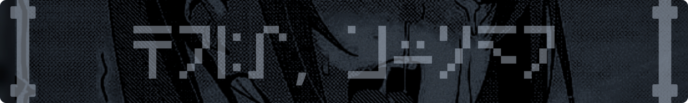

<div align="center">
  
</div>

<div align="center">
  <h1>😎 Atlaz White 😎</h1>
</div>

<div align="center">
	<i>¡HAY MUCHO POR EXPLORAR!</i>
	<br>
	<br>
	
	
	
	
	
	
	
	
	
	
	
	
	
	
	
	
	
	
	
	
	
	
	
	
	
	
		
</div>

---

## Hola a todos 

Mi alias es Atlaz White,

Aprovecho esta oportunidad para exponer que este perfil tiene como objetivo principal brindar apoyo a proyectos personales de terceros; principiantes y avanzados por igual.

Destaco que que la razón por la que hago esto es mi deseo de crecer no sólo en programación, sino en toda área de la informática.

## 🔭 Actualmente estoy trabajando en

En la actualidad, estoy desarrollando un software para la aplicación Termux, su propósito es sincronizar automáticamente los archivos y carpetas dentro de Termux con otros dispositivos que compartan la misma red Wi-Fi.

<div align="center">
	
</div>

Puede ver el proyecto haciendo [clic aquí](https://github.com/atlazwhite/termux-autosyncwith) o clonarlo mediante la siguiente instrucción:

```sh
git clone https://github.com/atlazwhite/termux-autosyncwith.git
```

## 🌱 Actualmente estoy aprendiendo

Se me han presentado muchas oportunidades para aprender, especialmente en la universidad. Teniendo esto en cuenta, he leído el contenido del siguiente año de la carrera y decidí prepararme estudiando PHP, Redes, Ingeniería de Software y Modelado de Base de Datos.

## 🤝 Estoy buscando colaborar en

Me encuentro enfocado en proyectos de pequeña escala y alto impacto. Y si el software promete ser de especial ayuda para otros devs, estoy dentro.

En el caso de que tenga o desee abrir un proyecto con estas características, no dudes en contactarme.

## 🤔 Busco ayuda con

Presento una pequeña lista de proyectos que reciben colaboraciones:

- [Termux - AutoSyncWith](https://github.com/atlazwhite/termux-autosyncwith.git) 
- Tinitex
- [Change Git Account (chga)](https://github.com/atlazwhite/chga.git)
- Trevor
- [Printcess](https://github.com/atlazwhite/printcess.git)
- [Leetify](https://github.com/atlazwhite/leetify.git)

📃 Los proyectos que no poseen un enlace están próximos a ser publicados.

## 📫 Cómo contactar conmigo

De momento, únicamente tengo disponibilidad vía [Discord](https://discord.com/invite/kX3emYgAFr) 😁

📃 El servidor al que vas a ingresar también es utilizado para informar sobre proyectos preexistentes, futuros y organizar grupos de trabajo. Dirígete al canal **contactar**.

## ❤️ Me encanta

Me gusta elaborar programas pequeños para ayudar a otros devs a tener una mejor experiencia y, en esencia, un incremento en su productividad.
Pronto subiré varias de estas piezas de software. Estaré atento a toda duda y sugerencia.

## ⚡ Dato curioso

Una de mis actividades favoritas es colaborar en trabajos de individuos anónimos en Reddit, ya sea a través de sugerencias o brindando apoyo con código.

Y otra es formar equipo con estos anónimos para llevar a cabo una solución de software. Todo esto mientras nos vamos conociendo.

*― Atlaz White*
